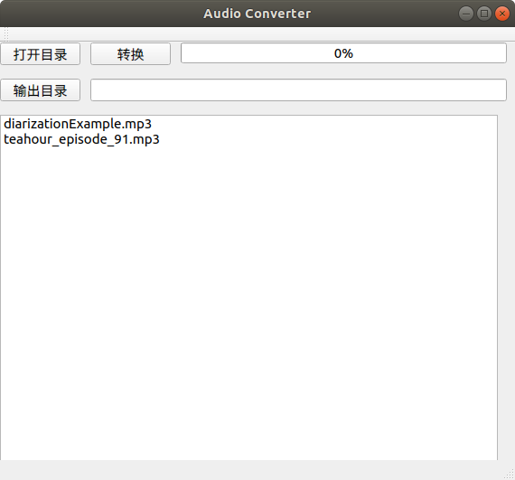

# Audio Converter
Simple Audio Converter.



## Requirements
- Python >=3.5 & < 3.7
- PyQt5 (4.9 is Better for fbs)
- fbs
- FFmpeg (standalone FFmpeg install in System)

## Notes
**subprocess.Popen without cmd console**
ffmpeg folder in source code is a fork of https://github.com/kkroening/ffmpeg-python with add `startupinfo` to forbid subprocess.Popen to open cmd console on Windows.
Tested on Windows 10.
```python
startupinfo = subprocess.STARTUPINFO()
startupinfo.dwFlags |= subprocess.STARTF_USESHOWWINDOW
return subprocess.Popen(
    args, stdin=stdin_stream, stdout=stdout_stream, stderr=stderr_stream, startupinfo=startupinfo
    )
```

## TODO
- [ ] logs.
- [ ] capture stdout and stderr of ffmpeg subprocess.
- [ ] converted audio's source format config. Now is a hard code as:
```python
[i for i in os.listdir(self.directory) if os.path.splitext(i)[-1][1:] in ['wma', 'mp3']])
``` 